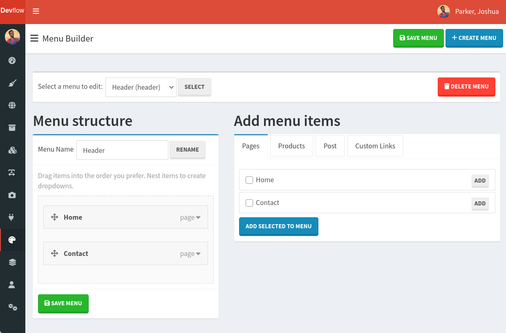

# Devflow Navigation Plugin

A full navigation/menu builder for Devflow CMF.

> __Requires__ Devflow Version: 2.x

> __Tested Up To:__ 2.2.1

> __Requires PHP:__ 8.4+

> __Stable Tag:__ 1.0.2

> __License:__ GPLv2-only

## Screenshot



## Features

- Unlimited menus: header, footer, sidebar, mobile, etc.
- Add by drag/drop, checkbox or Add button.
- Rename menu items.
- Change URL and CSS class.
- Add url attributes
- Open links in a new window.
- Remove menu items.
- Drag/drop nesting with jQuery UI Sortable.
- Database-backed storage.
- Renderer API for frontend templates.

## Codex Installation

1. Start a new shell session.
2. Navigate to the root of your install, run the following command ```php codex plugin:install getdevflow/menu-builder```.

## Frontend usage

```php
use Plugin\MenuBuilder\Helper\NavMenu;

echo NavMenu::render('header-menu', [
    'bootstrap' => 3,
    'menu_class' => 'nav navbar-nav',
]);
```

Or inject `Plugin\MenuBuilder\Support\NavigationRenderer` and call:

```php
echo $navigationRenderer->render('header-menu');
```

## Notes

The repository assumes these frontend URL conventions:

- Pages: value from `{prefix}_page_translations.route`
- Products: `/product/{product_slug}`
- Content: `/{content_type?}/{content_slug}`
